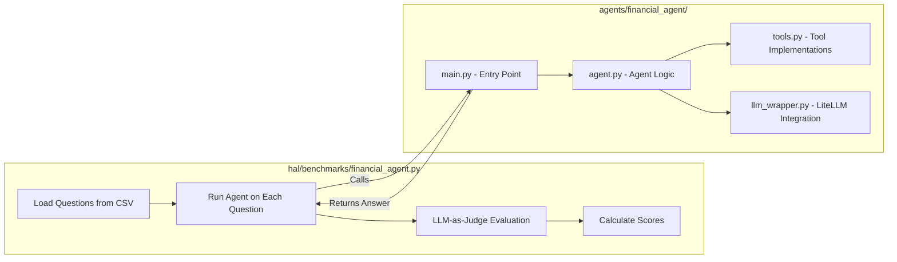
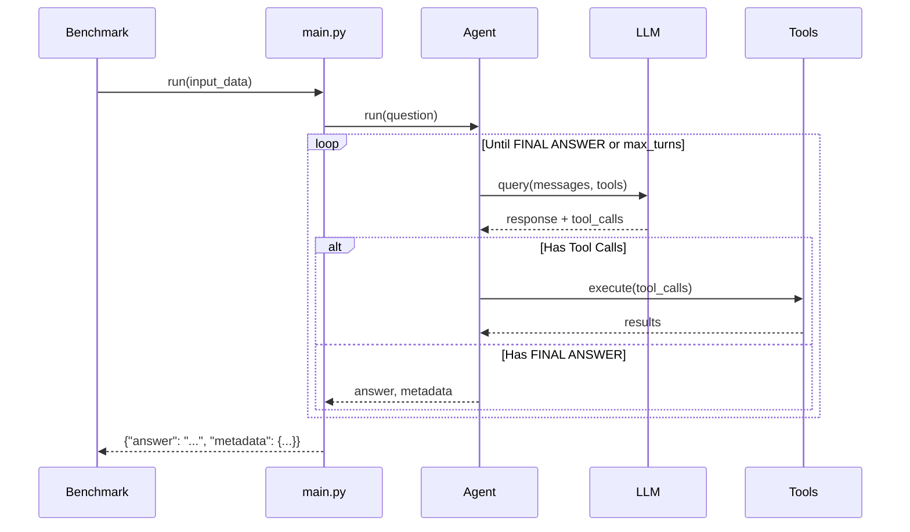

# Financial Agent System Documentation

This document explains the two core components of the financial agent evaluation system: the **benchmark** (evaluation harness) and the **agent** (the AI that answers questions).

---

## Architecture Overview



---

## Part 1: Benchmark (`hal/benchmarks/financial_agent.py`)

### Purpose
Evaluates financial research agents by testing them on questions about markets, SEC filings, and financial trends.

### Key Class: `FinancialAgentBenchmark`

| Method | Description |
|--------|-------------|
| `__init__` | Loads benchmark questions from `financial_agent/public.csv` |
| `_load_benchmark` | Parses CSV into question objects with rubrics |
| `evaluate_output` | Main evaluation loop - calls LLM-as-judge on each answer |
| `_evaluate_rubric_item` | Evaluates a single criterion (correctness or contradiction) |
| `_evaluate_rubric_batch` | Batch evaluates multiple criteria in one LLM call |
| `get_metrics` | Calculates final scores from evaluation results |

### Evaluation Flow

1. **Load Questions**: Parse CSV containing questions, ground truth answers, and rubrics
2. **Run Agent**: For each question, call the agent's `main.run()` function
3. **Evaluate Answer**: Use LLM-as-judge to check:
   - **Correctness**: Does the answer contain each required fact?
   - **Contradiction**: Does the answer contradict the ground truth?
4. **Score**: Calculate correctness percentage (contradictions → 0 score)

### Rubric Operators

| Operator | Description | Scoring |
|----------|-------------|---------|
| `correctness` | Check if agent mentions a specific fact | +1 if passed |
| `contradiction` | Check if agent contradicts ground truth | If found, final_score = 0 |

### Configuration Options (via `-A` flags)

```bash
-A eval_model=gpt-4o        # Model for LLM-as-judge
-A use_batch_eval=true      # Batch multiple criteria per LLM call
-A batch_size=10            # Criteria per batch
```

---

## Part 2: Agent (`agents/financial_agent/`)

### File Structure

| File | Purpose |
|------|---------|
| `main.py` | Entry point - called by benchmark harness |
| `agent.py` | Core agent logic - conversation loop, tool orchestration |
| `tools.py` | Tool implementations (Google search, EDGAR, etc.) |
| `llm_wrapper.py` | LiteLLM integration for model calls |
| `get_agent.py` | Agent factory - instantiates agent with tools |
| `prompt.py` | System instructions template |
| `utils.py` | Token/cost tracking utilities |
| `logger.py` | Logging configuration |

### Agent Execution Flow



### Available Tools

| Tool | Description |
|------|-------------|
| `GoogleWebSearch` | Search the web via SerpAPI |
| `EDGARSearch` | Search SEC EDGAR database for filings |
| `ParseHtmlPage` | Fetch and extract text from URLs |
| `RetrieveInformation` | LLM-powered summarization of stored data |

### Key Agent Methods

| Method | Description |
|--------|-------------|
| `run()` | Main entry point - runs conversation loop |
| `_process_turn()` | Execute one turn: call LLM, process tool calls |
| `_process_tool_calls()` | Execute all tool calls and collect results |
| `_find_final_answer()` | Extract answer text after "FINAL ANSWER:" |

### Agent Prompt Structure

```
You are a financial agent. Today is {date}.
When you have the answer, respond with 'FINAL ANSWER:' followed by your answer.

Question: {question}
```

---

## Running an Evaluation

```bash
hal-eval \
  --agent_name "financial_agent" \
  --agent_function main.run \
  --agent_dir agents/financial_agent \
  --benchmark financial_agent \
  -A model_name=openai/gpt-4o \
  -A eval_model=gpt-4o \
  --max_tasks 5
```

### Output Metrics

| Metric | Description |
|--------|-------------|
| `average_correctness` | Mean % of correctness criteria passed |
| `contradiction_rate` | % of questions with contradictions |
| `final_score` | Correctness score (0 if has contradiction) |

---

## Data Flow Summary

1. **Input**: Questions from `public.csv` with ground truth and rubrics
2. **Agent Processing**: Agent uses tools to research and formulate answer
3. **Output**: JSON with `answer` field and execution metadata
4. **Evaluation**: LLM-as-judge checks answer against rubric criteria
5. **Scoring**: Correctness % reduced to 0 if contradiction found
